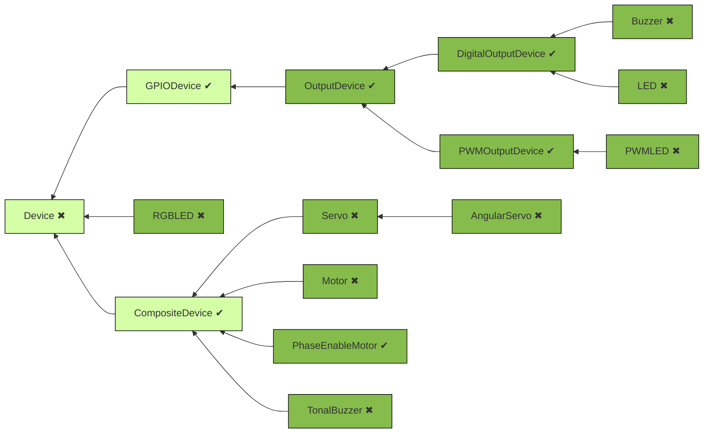

# Godot - LGPIO
One liner description.

# Setup
1. install `rgpiod` on the computer you want to control (eg Raspberri Pi).
2. run it: `sudo rgpiod`
3. on your host (where the Godot-lgpio will be running, possibly the same host,
depending on you situation) install `rgs` (debian/ubuntu: `sudo apt-get install rgpio-tools`)
4. you're ready to use the app!

# Usage
- by default, Godot-LGPIO connects to `localhost`, ie it access GPIOs of the board
it runs on.
- set `LG_ENVADDR` & `LG_ENVPORT` to work remotely and access GPIOS of the board
at those address & port.

Check out scenes in the `samples` directory.

# Facilities
## Devices
LGPIO (aims to) implements a few abstractions similar to [gpiozero](https://gpiozero.readthedocs.io/en/latest/api_output.html#base-classes)
(this is very much a work-in-progress).

Lighter classes are abstract, while darker ones are concrete / instanciable.

## Logging
`Godot-LGPIO` logs under 4 levels:

- `DEBUG`: Logs most events and gives a verbose overview of what's happening in the lib.
- `INFO`: Default level.
- `WARNING`: for local errors detected within this lib.
- `ERROR`: when the underlying stack (rgs/lgpio) returns errors.

# WIP Status
Not all of `lgpio` API is implemented. This is a work in progress where PRs are welcome. Here's a table
to track what's suported and what's not:

| Command | Supported |
| :-------| :-------: |
| FILES   | --------- |
| FO      | ✖         |
| FC      | ✖         |
| FR      | ✖         |
| FW      | ✖         |
| FS      | ✖         |
| FL      | ✖         |
| GPIO    | --------- |
| GO      | ✔         |
| GC      | ✔         |
| GIC     | ✔         |
| GIL     | ✔         |
| GMODE   | ✔         |
| GSI     | ✔         |
| GSIX    | ✔         |
| GSO     | ✔         |
| GSOX    | ✔         |
| GSA     | ✖         |
| GSAX    | ✖         |
| GSF     | ✔        |
| GSGI    | ✔        |
| GSGIX   | ✔        |
| GSGO    | ✔        |
| GSGOX   | ✔        |
| GSGF    | ✔        |
| GR      | ✔        |
| GW      | ✔        |
| GGR     | ✖         |
| GGW     | ✖         |
| GGWX    | ✖         |
| GP      | ✔        |
| GPX     | ✔        |
| P       | ✖         |
| PX      | ✖         |
| S       | ✖         |
| SX      | ✖         |
| GWAVE   | ✖         |
| GBUSY   | ✖         |
| GROOM   | ✖         |
| GDEB    | ✖         |
| GWDOG   | ✖         |
| I2C     | --------- |
| I2CO    | ✖         |
| I2CC    | ✖         |
| I2CWQ   | ✖         |
| I2CRS   | ✖         |
| I2CWS   | ✖         |
| I2CRB   | ✖         |
| I2CWB   | ✖         |
| I2CRW   | ✖         |
| I2CWW   | ✖         |
| I2CRK   | ✖         |
| I2CWK   | ✖         |
| I2CWI   | ✖         |
| I2CRI   | ✖         |
| I2CRD   | ✖         |
| I2CWD   | ✖         |
| I2CPC   | ✖         |
| I2CPK   | ✖         |
| I2CZ    | ✖         |
| NOTIFICATIONS | --- |
| NO      | ✖         |
| NC      | ✖         |
| NP      | ✖         |
| NR      | ✖         |
| SCRIPTS | --------- |
| PROC    | ✖         |
| PROCR   | ✖         |
| PROCU   | ✖         |
| PROCP   | ✖         |
| PROCS   | ✖         |
| PROCD   | ✖         |
| PARSE   | ✖         |
| SERIAL  | --------- |
| SERO    | ✖         |
| SERC    | ✖         |
| SERRB   | ✖         |
| SERWB   | ✖         |
| SERR    | ✖         |
| SERW    | ✖         |
| SERDA   | ✖         |
| SHELL   | --------- |
| SHELL   | ✖         |
| SPI     | --------- |
| SPIO    | ✖         |
| SPIC    | ✖         |
| SPIR    | ✖         |
| SPIW    | ✖         |
| SPIX    | ✖         |
| UTILITIES | ------- |
| LGV     | ✖         |
| SBC     | ✖         |
| CGI     | ✖         |
| CSI     | ✖         |
| T/TICK  | ✖         |
| MICS    | ✖         |
| MILS    | ✖         |
| U/USER  | ✖         |
| C/SHARE | ✔ (Chip._share_id) |
| LCFG    | ✖         |
| PCD     | ✖         |
| PWD     | ✖         |
