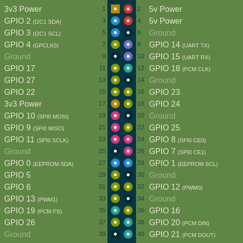
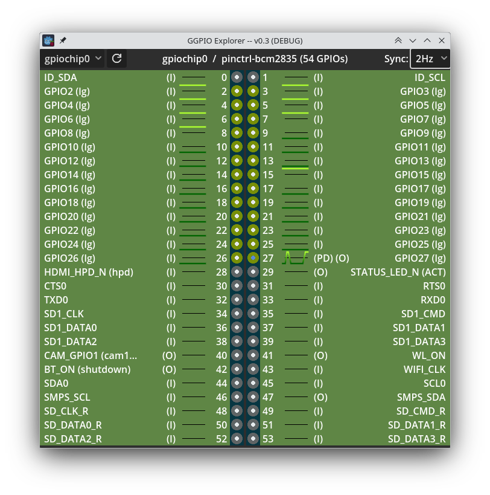
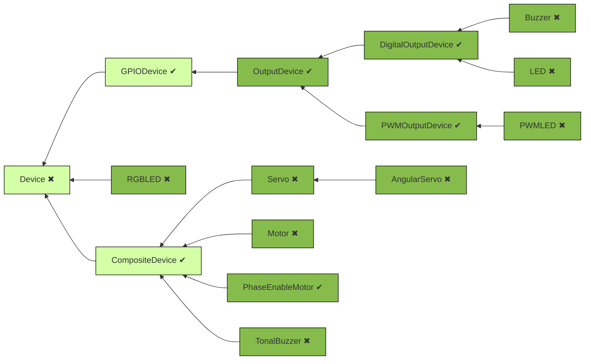

<p align="center">
  
</p>

# Godot-GPIO
A [Godot](https://godotengine.org/)/GDScript addon to access GPIO on linux hosts (eg Raspberry Pi).

[](https://www.buymeacoffee.com/valbisson)

# Setup
`Godot-GPIO` (`ggpio`) depends on [lg](https://abyz.me.uk/lg/index.html):
1. [install](#requirements) `rgpiod` on the computer you want to control (eg Raspberri Pi).
2. run it: `sudo rgpiod` (or start it as a deamon: `sudo nohup rgpiod`
3. on your host (where the `ggpio` will be running, possibly the same host,
depending on you situation) [install](#requirements) `rgs`

# Requirements
- on Raspberri Pi: `sudo apt-get install rgpio-tools`
- others: download & compile `rgs` using [`lg`'s install info](https://abyz.me.uk/lg/download.html):
	```bash
	wget http://abyz.me.uk/lg/lg.zip
	unzip lg.zip
	cd lg
	make
	sudo make install
	```

# Introduction
Here's a quick rundown of the main classes:
- `ggpio`: `class_name`'d to make it globally available, it can be considered a
namespace for the project, so that no other gd script needs to be imported in most cases.
- `ggpio.SBC`: (Single Board Computer). That's the host we'll be interacting with.
- `ggpio.Chip`: refers to a gpiochip under [the kernel's GPIO driver interface](https://docs.kernel.org/driver-api/gpio/driver.html).
Most of the time we're workin with gpio `0`.
- `ggpio.GPIO`: this is a single pin on a board. GPIOs on a Pi are numbererd
[as such](https://pinout.xyz/):
<p align="center">
  
</p>

**Note** that some pins in the diagram above are not GPIO, and as such, won't be visible in the lib. Reversely, depending on the SBC,
some devices may appears as GPIO while not being mentioned in the diagram above.
- `ggpio.lg` this is where the low level `lg`/`rpio` interface is implemented. The flow is to create an `LGCommand` and `run` it on an `SBC`.

# Usage
In a nutshell:
```gdscript
var sbc_hostname := 'rpi.local'
var sbc := ggpio.SBC.new(sbc_hostname)
var chip := sbc.open_chip('0')
gpio27 = chip.open_gpio(
	27,
	ggpio.Mode.OUTPUT,
	ggpio.LineFlag.PULL_DOWN,
	ggpio.Level.LOW
)
gpio27.write(ggpio.Level.HIGH)
assert(gpio27.read() == ggpio.Level.HIGH)
```

For more, check out scenes in the [samples](./samples) directory. Couple points:

- Each scene can be played independently (`F6`)
- the main scene is *GPIO explorer*, kind of a live version of the pinout above,
but dedicated to GPIO:
<p align="center">
  
</p>


Note:
- by default, `ggpio` connects to `localhost`, ie it access GPIOs of the board
it runs on.
- set `LG_ENVADDR` & `LG_ENVPORT` to work remotely and access GPIOS of the board
at those address & port.


# Facilities
## Devices
GGPIO implements a few abstractions similar to [gpiozero](https://gpiozero.readthedocs.io/en/latest/api_output.html#base-classes)
(this is very much a work-in-progress).

Legend:
- lighter classes are abstract
- darker ones are concrete / instanciable
- classes marked with a ✔ have been implemented
- classes marked with a ✖ are not written yet (I may lack the hardware to test them,
contributions are welcome!)




## Logging
`Godot-GPIO` logs under 4 levels:

- `VERBOSE`: to debug the lib itself. Will flood your terminal.
- `DEBUG`: Logs most events and gives a verbose overview of what's happening in the lib.
- `INFO`: Default level.
- `WARNING`: for local errors detected within this lib.
- `ERROR`: when the underlying stack (rgs/lg) returns errors.

# WIP Status
Not all of `rgs` API is implemented (but still available as raw commands). This is a work in progress
where contributions are welcome. In addition to the high-level classes described above, here's a table
 to track which which parts of [rgs API](https://abyz.me.uk/lg/rgs.html) are supported:

| Command | Supported |
| :-------| :-------: |
| LEGEND  | --------- |
| CMD     | ✖         | <- `CMD` supported as raw command only
| CMD     | ✔        | <- `CMD` is supported in high-level objects
| CMD     | ?        | <- there's no current plan to support `CMD`
| FILES   | --------- |
| FO      | ?         |
| FC      | ?         |
| FR      | ?         |
| FW      | ?         |
| FS      | ?         |
| FL      | ✔        |
| GPIO    | --------- |
| GO      | ✔         |
| GC      | ✔         |
| GIC     | ✔         |
| GIL     | ✔         |
| GMODE   | ✔         |
| GSI     | ✔         |
| GSIX    | ✔         |
| GSO     | ✔         |
| GSOX    | ✔         |
| GSA     | ✖         |
| GSAX    | ✖         |
| GSF     | ✔        |
| GSGI    | ?        |
| GSGIX   | ?        |
| GSGO    | ?        |
| GSGOX   | ?        |
| GSGF    | ✖        |
| GR      | ✔        |
| GW      | ✔        |
| GGR     | ✖         |
| GGW     | ✖         |
| GGWX    | ✖         |
| GP      | ✔        |
| GPX     | ✔        |
| P       | ✖         |
| PX      | ✖         |
| S       | ✖         |
| SX      | ✖         |
| GWAVE   | ✖         |
| GBUSY   | ✖         |
| GROOM   | ✖         |
| GDEB    | ✖         |
| GWDOG   | ✖         |
| I2C     | --------- |
| I2CO    | ✖         |
| I2CC    | ✖         |
| I2CWQ   | ✖         |
| I2CRS   | ✖         |
| I2CWS   | ✖         |
| I2CRB   | ✖         |
| I2CWB   | ✖         |
| I2CRW   | ✖         |
| I2CWW   | ✖         |
| I2CRK   | ✖         |
| I2CWK   | ✖         |
| I2CWI   | ✖         |
| I2CRI   | ✖         |
| I2CRD   | ✖         |
| I2CWD   | ✖         |
| I2CPC   | ✖         |
| I2CPK   | ✖         |
| I2CZ    | ✖         |
| NOTIFICATIONS | --- |
| NO      | ✖         |
| NC      | ✖         |
| NP      | ✖         |
| NR      | ✖         |
| SCRIPTS | --------- |
| PROC    | ✖         |
| PROCR   | ✖         |
| PROCU   | ✖         |
| PROCP   | ✖         |
| PROCS   | ✖         |
| PROCD   | ✖         |
| PARSE   | ✖         |
| SERIAL  | --------- |
| SERO    | ✖         |
| SERC    | ✖         |
| SERRB   | ✖         |
| SERWB   | ✖         |
| SERR    | ✖         |
| SERW    | ✖         |
| SERDA   | ✖         |
| SHELL   | --------- |
| SHELL   | ✖         |
| SPI     | --------- |
| SPIO    | ✖         |
| SPIC    | ✖         |
| SPIR    | ✖         |
| SPIW    | ✖         |
| SPIX    | ✖         |
| UTILITIES | ------- |
| LGV     | ✖         |
| SBC     | ✖         |
| CGI     | ✖         |
| CSI     | ✖         |
| T/TICK  | ✖         |
| MICS    | ✖         |
| MILS    | ✖         |
| U/USER  | ✖         |
| C/SHARE | ✔ (Chip.share_id) |
| LCFG    | ✖         |
| PCD     | ✖         |
| PWD     | ✖         |

## FAQ

### Why spam `rds` subprocesses instead of doing a proper rgpio / GDExtension integration?
I know. I wish I had the time. I'm working on this as a side-quest for a hobby.
If the lib picks up, we'll plug a strategy pattern in, and add a native rpgio implementation.
Until then, this is a quick[1] and dirty way to get Godot to play with the Pi.

[1] quick to implement, not quick to run.


## Changelog

### 0.3
- moved all `lg` commands into the `ggpio.lg` namespace
- added `SBC` class, refactored `Chip` & `GPIO` into an object oriented API

### 0.2
- ggpio explorer and fixes

### 0.1
- first working version
